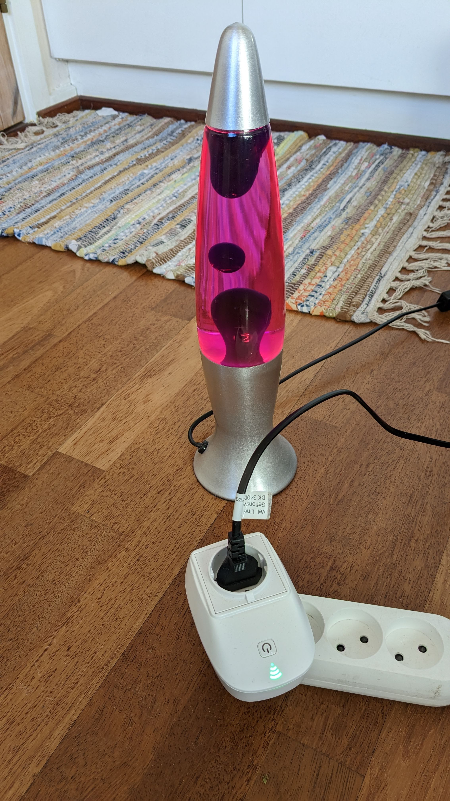

# Eco Power Swich

Program in [Toit](https://toitlang.org/) to switch a power outlet on and off
based on the current price of electricity in Denmark.  This is also a good
proxy for the greenness of the electricity, as the price is largely determined
by the amount of wind and solar power available.

Thanks to https://www.elprisenligenu.dk/ for the free electricity
price API.

Runs on an [ESP32](https://www.espressif.com/en/products/socs/esp32)-based
smart plug, which is unfortunately not currently available for sale.
Should be easy to adapt to a different ESP32-based smart plug.
Join [the Toit chat](https://chat.toit.io/) to learn more about Toit.

The smart plug has a button.  Pressing the button moves between
the three modes, AUTO, ON, and OFF.  After a power cut it starts in the AUTO
mode,

There is an RGB LED, controlled by the ESP32's PWM generator.  The color
coding is:

* Green
  - Electricity is cheap, power is on.
* Orange
  - Electricity is expensive, power is off.
* Red
  - Electricity is very expensive, power is off.
* Blue + Green (Turquoise/Cyan)
  - Plug is in manual override mode, on.
* Blue + Red (Purple)
  - Plug is in manual override mode, off.
* Off
  - Plug cannot fetch price data, off.

