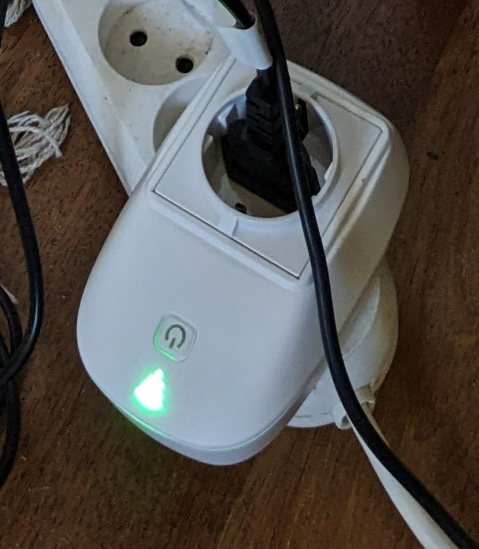

# Eco Power Swich

Program to switch a power outlet on and off based on the current
price of electricity in Denmark.  This is also a good proxy for
the greenness of the electricity, as the price is largely determined
by the amount of wind and solar power available.

Runs on an ESP32-based smart plug, which is unfortunately not
currently available for sale.

The smart plug has a button.  Pressing the button moves between
the three modes, AUTO, ON, and OFF.  After a power cut it starts in the AUTO
mode,

There is an RGB LED, controlled by the ESP32's PWM generator.  The color
coding is:

* Green
  - Electricity is cheap, power is on.
* Orange
  - Electricity is expensive, power is off.
* Red
  - Electricity is very expensive, power is off.
* Blue + Green (Turqoise)
  - Plug is in manual override mode, on.
* Blue + Red (Purple)
  - Plug is in manual override mode, off.
* Off
  - Plug cannot fetch price data, off.

